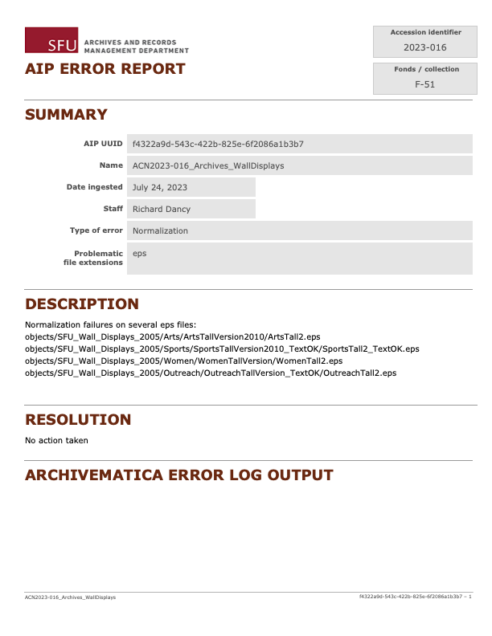

###### [Archivematica Manual](../README.md) `|` [Ingest Guidelines](overview.md)
###### [Start a Transfer](start-transfer.md) `|` [Decision Points](decision-points.md) `|` [Update AIS](update-ais.md) `|` Errors

# Errors

Archivematica sometimes encounters errors during processing. Errors can be fatal or non-fatal:
- Fatal error = Archivematica cancels the transfer process without completion.
- Non-fatal error = Archivematica throws an error message but continues processing the transfer to completion.

In the Archivematica Dashboard, errors are flagged as highlighted (red) microservices jobs.
- Error reports can also be accessed from the Archivematica **Administration > Failures** tab.
- In most cases, Archivematica will also send an error report email to selected users (controlled by a setting on their user profile).

In the AIS, use the **AIP Error Report** to document errors, especially non-fatal ones. This data is stored in a separate database table (`AIPErrorReport`) linked to the `AIP` table. It captures the following information:
- `Date ingested` and `Staff`.
- `Type of error`.
- `Description`, `Resolution` and `Archivematica error log output`.
- `Problematica file formats` (if applicable).

Where feasible, copy the Archivematica error message into the `Archivematica error log output` field.

From the AIS, print / save as pdf error reports and file on the fonds **Collection file**. 

###### Last updated: Jul 24, 2023
