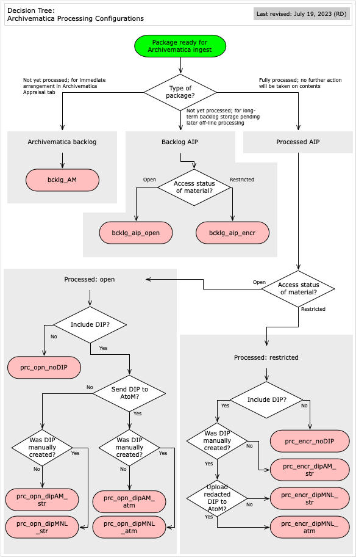

###### [Archivematica Manual](../README.md) `>` Processing Configurations

# Processing Configurations
###### Last updated: Jul 21, 2023
Archivematica **processing configurations** set default values for **decision point** fields and how many are exposed to the archivist, requiring manual intervention (selection of an option). The Archives has three main types of processing configs:
1. [The Default configuration](#default-configuration) - used as default when user clicks the `Start transfer` button rather than selecting a specific config.
1. [Standardized configurations](#standardized-configurations) - 12 configs that cover various common ingest scenarios.
1. [Customized configurations](#customized-configurations) - one-off configs for specific projects.

For more detail, see Archivematica's own [documentation describing processing configuration fields and their options](https://www.archivematica.org/en/docs/archivematica-1.14/user-manual/administer/dashboard-admin/#dashboard-processing).

## Default configuration
The Archives' default processing config exposes 10 decision points that require the archivist's intervention; see [Decision Points](../ingest-guidelines/decisions-points.md) for a description of options.

| Config | Description |
|:---	   |:---         |
| [Default](default.md) | Basic config |

## Standardized configurations

The Archives has created a set of 12 processing configs to automate ingest by specifying in advance the values for **all** decision point fields for a given transfer. Because not all transfers can be handled in the same way, there are multiple configs to cover most ingest scenarios.

Click the **Decision tree** image to view the factors determining which config to use in any given situation. The settings for each config are described below and also in a [spreadsheet that can be downloaded separately here](../downloads/processing-configs-compared.xlsx).

### Archivematica backlog
This config sends transfer packages to the Archivematica **Backlog** tab.
- Use **only** when you intend to use Archivematica for appraisal, selection and arrangement via the **Appraisal** tab and in the near future.
- Archivematica's Backlog space should **not** be used for long-term backlog storage; create [Backlog AIPs](#backlog-aips) instead.

| Config | Description |
|:---	   |:---         |
| [bcklog_AM](bcklg-am.md) | Sends transfer to Archivmatica backlog |

### Backlog AIPs
These configs create **Backlog AIPs** – full Archivematica AIPs, but with **no** normalization for preservation or access, i.e. files are stored in original formats only.

Use to send transfers to backlog for later archival processing outside Archivematica. This entails downloading and working on the files (appraisal, selection, arrangement), then re-ingesting the new package and deleting of the old `Backlog AIP`.

Normalization is omitted at this stage because:
- Normalization creates preservation copies in the same directory as the originals, making later processing (and re-ingest) more cumbersome – the processing archivist will want to work on the set of original files rather than a double set of originals + preservation copies.
- Normalization creates access copies in a single, flattened directory, regardless of their location in the original folder hierarchy – with large transfers, this makes it difficult to locate access copies as needed.

The main variable here is whether or not to encrypt the `Backlog AIP`.
- Choose to encrypt if there is any possibility that the transfer contains personal or confidential information.

| Config | Description |
|:---	   |:---         |
| [bcklg_encr](bcklg-encr.md) | Full (backlog) AIP, no normalization, send to encrypted storage |
| [bcklg_opn](bcklg-opn.md) | Full (backlog) AIP, no normalization, send to open (non-encrypted) storage |

### Processed AIPs
Use these configs for fully processed AIPs, i.e. the contents have been appraised, selected and arranged and will not be subject to further action or changes.

The main variables are whether to:
- Store encrypted or open.
- Create DIPs via Archivematica or manually or not at all.
- Send DIPs to AtoM or not.

Materials with `access status` = "pending review" should be stored encrypted.

All packages will be normalized for preservation.

If DIPs are created, they are stored. DIPs for restricted materials may be created by making a redacted copy outside Archivematica; see the [DIP management section](../dip-management/overview.md) for more detail.

#### Open materials (no restrictions apply)
| Config | Description |
|:---	   |:---         |
| [prc_opn_noDIP](prc-opn-nodip.md) | Open storage, no DIP normalization or storage |
| [prc_opn_dipMNL_atm](prc-opn-dipmnl-atm.md) | Open storage, DIP created manually outside Archivematica, send DIP to AtoM |
| [prc_opn_dipMNL_str](prc-opn-dipmnl-str.md) | Open storage, DIP created manually outside Archivematica, do not send DIP to AtoM |
| [prc_opn_dipAM_atm](prc-opn-dipam-atm.md) | Open storage, normalize for access, send DIP to AtoM |
| [prc_opn_dipAM_str](prc-opn-dipam-str.md) | Open storage, normalize for access, do not send DIP to AtoM |

#### Restricted / pending review materials
| Config | Description |
|:---	   |:---         |
| [prc_encr_noDIP](prc-encr-nodip.md) | Encrypted storage, no DIP normalization or storage |
| [prc_encr_dipMNL_atm](prc-encr-dipmnl-atm.md) | Encrypted storage, DIP (redacted) created manually outside Archivematica, send (redacted) DIP to AtoM |
| [prc_encr_dipMNL_str](prc-encr-dipmnl-str) | Encrypted storage, DIP (redacted) created manually outside Archivematica, do not send DIP to AtoM |
| [prc_encr_dipAM_str](prc-encr-dipam-str.md) | Encrypted storage, normalize for access, do not send DIP to AtoM |

## Customized configurations
