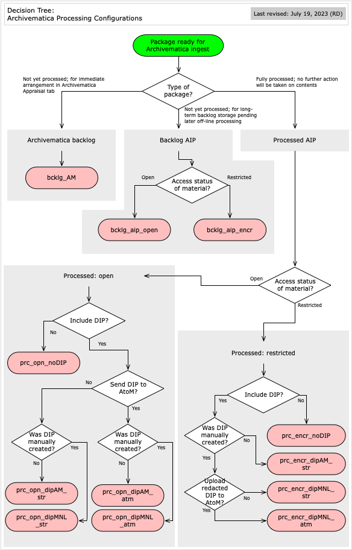

###### [Archivematica Manual](../README.md) `>` [Processing Configurations](overview.md)

# Standardized Processing Configurations

The Archives has created a set of 12 **processing configurations** to automate ingest by specifying in advance the values for **all** decision point fields for a given transfer. Because not all transfers can be handled in the same way, different configs to cover different ingest scenarios.

Click the **Decision tree** image to view the factors determining which config to use in any given situation.

## Archivematica backlog
This config sends transfer packages to the Archivematica **Backlog** tab.
- Use **only** when you intend to use Archivematica for appraisal, selection and arrangement via the **Appraisal** tab and in the near future.
- Archivematica's Backlog space should **not** be used for long-term backlog storage; create [Backlog AIPs](#backlog-aips) instead.

**Config:**
- [bcklog_AM](bcklg-am.md)

## Backlog AIPs
These configs create **Backlog AIPs** – full Archivematica AIPs, but with **no** normalization for preservation or access, i.e. files are stored in original formats only.

Use to send transfers to backlog for later archival processing outside Archivematica. This entails downloading and working on the files (appraisal, selection, arrangement), then re-ingesting the new package and deleting of the old `Backlog AIP`.

Normalization is omitted at this stage because:
- Normalization creates preservation copies in the same directory as the originals, making later processing (and re-ingest) more cumbersome – the processing archivist will want to work on the set of original files rather than a double set of originals + preservation copies.
- Normalization creates access copies in a single, flattened directory, regardless of their location in the original folder hierarchy – with large transfers, this makes it difficult to locate access copies as needed.

The main variable here is whether or not to encrypt the `Backlog AIP`.
- Choose to encrypt if there is any possibility that the transfer contains personal or confidential information.

**Configs:**
- [bcklg_encr](bcklg-encr.md) - encrypted
- [bcklg_opn](bcklg-opn.md) - open

## Processed AIPs
Use these configs for fully processed AIPs, i.e. the contents have been appraised, selected and arranged and will not be subject to further action or changes.

The main variables are whether to:
- Store encrypted or open.
- Create DIPs via Archivematica or manually or not at all.
- Send DIPs to AtoM or not.

Materials with `access status` = "pending review" should be stored encrypted.

All packages will be normalized for preservation.

If DIPs are created, they are stored. DIPs for restricted materials may be created by making a redacted copy outside Archivematica; see the [DIP management section](../dip-management/overview.md) for more detail.

**Configs:**

Open materials (no restrictions):
- [prc_opn_noDIP](prc-opn-nodip.md) - No DIP created
- [prc_opn_dipAM_atm](prc-opn-dipam-atm.md) - DIP created by Archivematica, sent to AtoM
- [prc_opn_dipAM_str](prc-opn-dipam-str.md) - DIP created by Archivematica, not sent to AtoM
- [prc_opn_dipMNL_atm](prc-opn-dipmnl-atm.md) - DIP created manually, sent to AtoM
- [prc_opn_dipMNL_str](prc-opn-dipmnl-str.md) - DIP created manually, not sent to AtoM

Restricted / pending review materials:
- [prc_encr_noDIP](prc-encr-nodip.md) - No DIP created
- [prc_encr_dipAM_str](prc-encr-dipam-str.md) - DIP created by Archivematica, not sent to AtoM
- [prc_encr_dipMNL_str](prc-encr-dipmnl-str) - DIP created manually, not sent to AtoM
- [prc_encr_dipMNL_atm](prc-encr-dipmnl-atm.md) - redacted DIP created manually, sent to AtoM

###### Last updated: Jul 21, 2023
